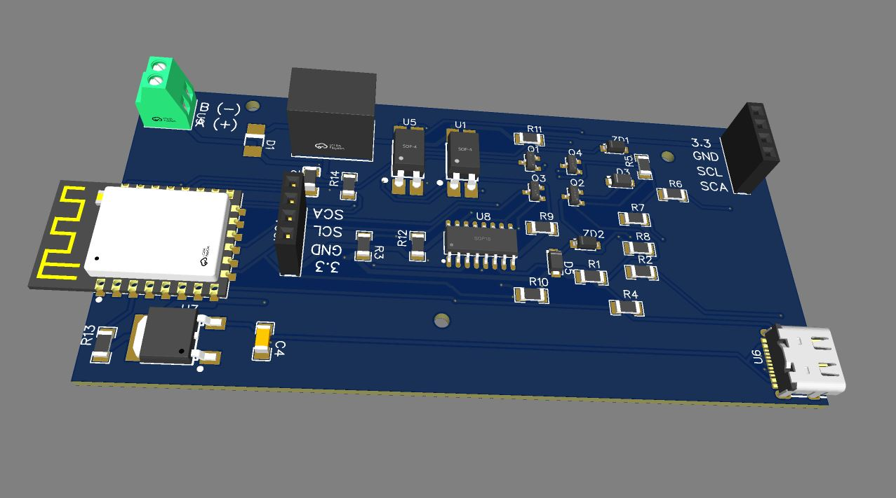
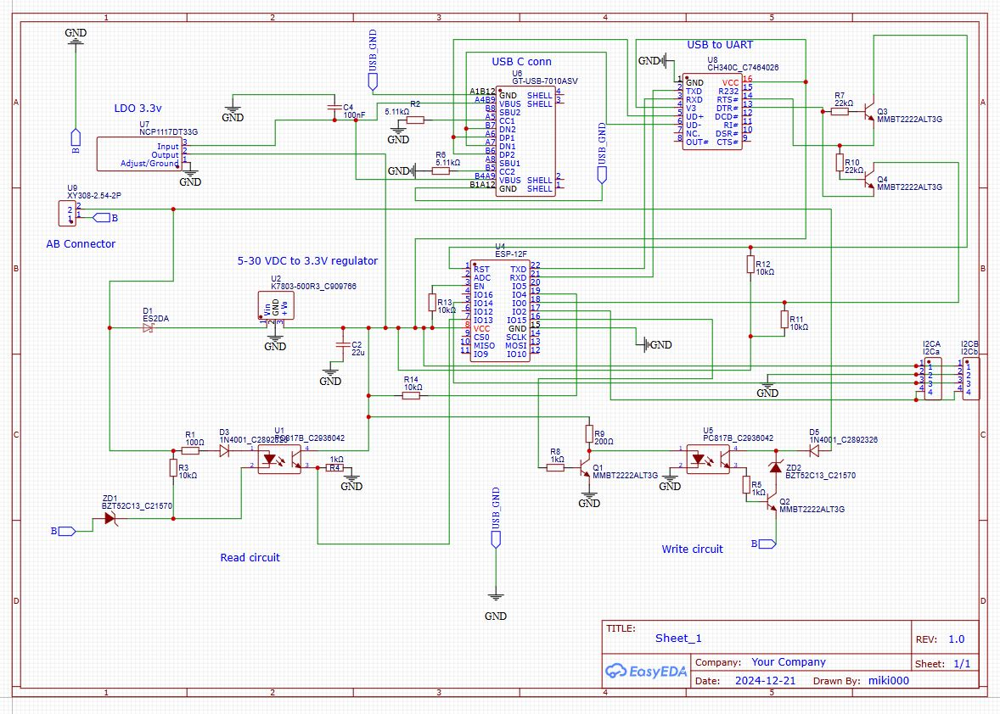
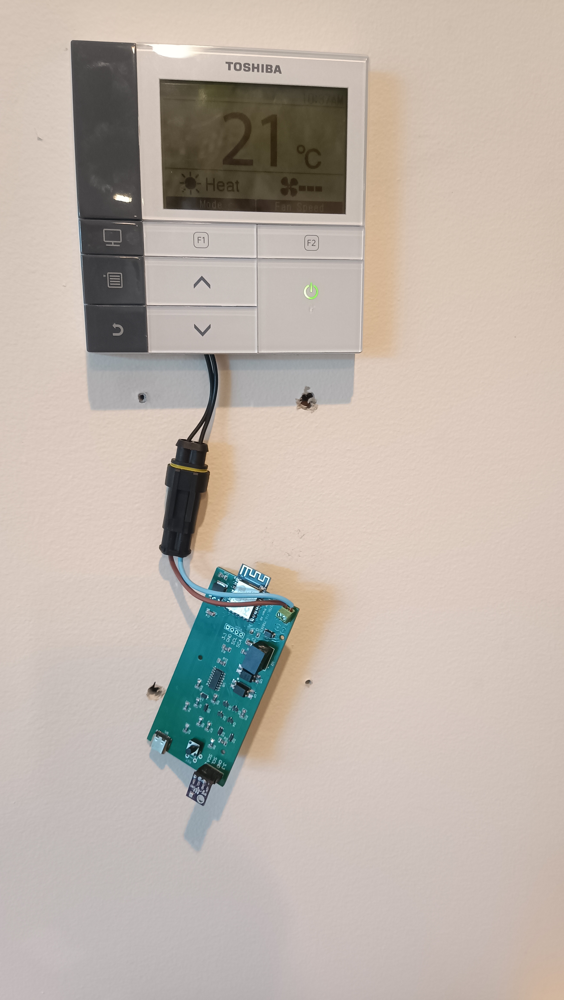
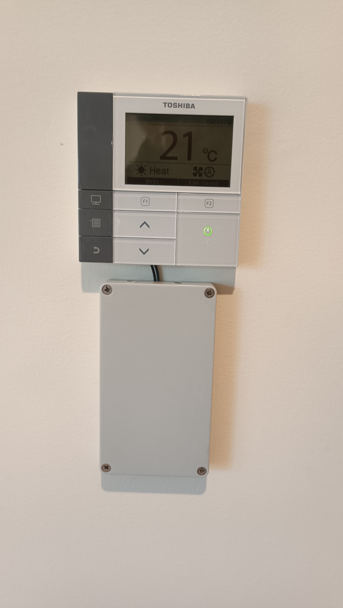

# Ordering or building the board

You will need to build the compatible hardware. This folder contains all necessary files. I designed the board using EasyEDA online editor (free). All files are EasyEDA compatible format.
EasyEDA.zip file can be imported onto EasyEDA editor to open the project with schematics and board design.

Alternatively, you can order the board from places like JLCPCB. You will need the 3 files included:

  - Gerber.zip: This is the gerber file for the physical design of the board
  - BOM_01.csv or BOM_02.csv: Just choose one of them, they are slightly different format to maximise compatibility. They contain the list of components (BOM).
  - PickAndPlace.csv: The information on where to place the component on the board.

When ordering, make sure all components are selected in the list (components that incur an extra fee, need to be manually ticked)
Use the 3D view to double check that all components appear on the board.

## Component shortfall

It often happens that components are out of stock or become unavailable and need to be replaced when uploading the BOM file. If you are not comfortable in doing so,
tick the option of "parts sourced by JLCPCB" instead of "by customer". That should make it easy to replace shortfalls. Otherwise, use the search option and look for an equivalent component. The 3D view on the next page can be useful to double check that you made the right choice.

# Schematic

This is the schematic of the board.

# Final product

This is how I installed it

      

